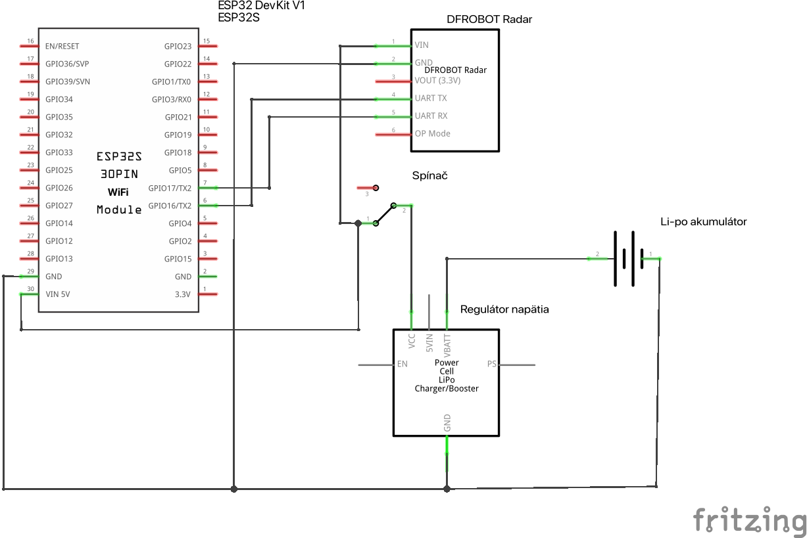

# 🌀 BikeEyes Radar Firmware 🚴

This is the firmware for the BikeEyes Radar project.
Code tested on DOIT ESP32 DevKit v1.

## 📖 Documentation

In the loop function, the microcontroller reads the distance from the sensor and sends it via Bluetooth to the Android application. The following functions are used:

`void sendData(float *dst, float *speed)` - sends data using the serial interface (Bluetooth)

`float get_dst(float *d)` - returns the distance of the object after performing a average filter

`float get_avg_dst()` - returns the average distance of the object after performing a average filter

## Schematics

## License

[MIT](./LICENSE)